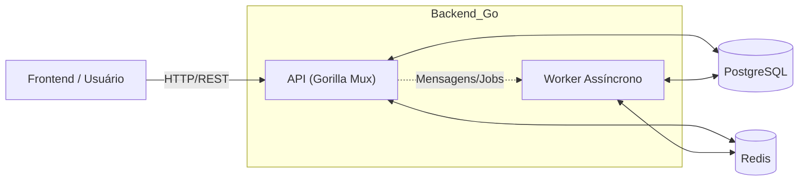

# 🛡️ Guardião da Saúde - Backend (GoLang & AWS Architecture)

Este repositório contém o backend do projeto Guardião da Saúde, desenvolvido em Go (Golang), com arquitetura robusta, resiliente e escalável. O ambiente local simula serviços gerenciados da AWS (RDS/ElastiCache/filas) via Docker Compose e permite deploy em provedores como Render/Fly/Cloud Run.

## 🌟 Visão Geral da Arquitetura

A aplicação adota uma arquitetura orientada a serviços para garantir alta disponibilidade, desacoplamento e escalabilidade.

| Camada                 | Tecnologia Principal        | Função Chave                                                           |
|------------------------|----------------------------|------------------------------------------------------------------------|
| API Síncrona           | Go (Gorilla Mux)           | Autenticação, Perfil, CRUD de Hábitos, Ranking e Gestão de Mana.      |
| Persistência           | PostgreSQL (RDS) & Redis   | Armazenamento de dados e cache de performance (ElastiCache).          |
| Worker Assíncrono      | Go                         | Processamento assíncrono de eventos (ex.: logs/mana).                 |
| Infraestrutura         | Docker Compose             | Orquestração local do DB, Cache, API e Worker.                        |

## 🖥️ Diagrama da Arquitetura

Diagrama simplificado e validado para renderização no GitHub.



## 📂 Estrutura do Projeto

- cmd/
    - api/ → entrypoint do servidor HTTP
    - gamification_worker/ → entrypoint do worker
- internal/
    - auth, users, habits, gamification
    - platforms/
        - db (Postgres), cache (Redis)
        - aws (SQS/SNS com SDK v2) — suporte a LocalStack
- docker/
    - docker-compose.yml (base)
    - docker-compose.dev.yml (overlay dev)
    - docker-compose.prd.yml (overlay prod local)
    - Dockerfile-api (API) e Dockerfile-worker (Worker)
    - .env.development / .env.production / .env.e2e (exemplos)
- tests/
    - e2e/ → suíte de testes end-to-end (Go)

Observações:
- O .dockerignore deve ficar na raiz do repositório (mesmo diretório do contexto de build).
- Os overlays (dev/prd/e2e) SEMPRE são usados em conjunto com o compose base.

## 🔧 Pré-requisitos

- Docker Desktop (ou Docker Engine + Docker Compose v2)
- Make (opcional, recomendado)
- Go 1.22+ (opcional — para desenvolvimento e testes fora de Docker)

## ▶️ Como rodar (Desenvolvimento)

1) Configure variáveis (edite docker/.env.development conforme necessário).

2) Suba a stack (base + dev):
```bash
make up-dev ENV_FILE=docker/.env.development
# ou:
docker compose --env-file docker/.env.development \
  -f docker/docker-compose.yml \
  -f docker/docker-compose.dev.yml up --build -d
```

3) Health:
```bash
curl http://localhost:8080/health
# ok
```

Base URL local do backend:
- http://localhost:8080/api/v1

## 🔒 Segurança & CORS

- Defina JWT_SECRET seguro em produção.
- CORS: configure CORS_ORIGINS para incluir o domínio do frontend (Vercel) e localhost:3000:
    - CORS_ORIGINS="https://seu-frontend.vercel.app,http://localhost:3000"
- Nunca versione segredos (.env.production no .gitignore).

## 🌐 Frontend (Vercel) consumindo a API

- NEXT_PUBLIC_API_BASE_URL
    - Dev: http://localhost:8080/api/v1
    - Prod: URL pública do backend (ex.: Render)
- Backend deve permitir a origem do frontend via CORS_ORIGINS.

## 🧪 Testes End-to-End (E2E)

Execute os fluxos principais (health, auth, perfil, hábitos, logs, erros).

Com backend local em 8080:
```bash
E2E_BASE_URL=http://localhost:8080/api/v1 go test ./tests/e2e -v -count=1 -timeout=10m
```

Se preferir isolar em outra porta (18080), adicione um overlay docker-compose.e2e.yml e alvos make e2e.

## ☁️ Plataforma AWS (SQS/SNS)

Clientes prontos em internal/platforms/aws usando AWS SDK for Go v2, com suporte a LocalStack (endpoint override via BaseEndpoint).

Variáveis (LocalStack):
- AWS_REGION=us-east-1
- AWS_ACCESS_KEY_ID=dummy
- AWS_SECRET_ACCESS_KEY=dummy
- AWS_SQS_ENDPOINT=http://localhost:4566
- AWS_SNS_ENDPOINT=http://localhost:4566
- AWS_SQS_QUEUE_URL=http://localhost:4566/000000000000/guardiao-events
- AWS_SNS_TOPIC_ARN=arn:aws:sns:us-east-1:000000000000:guardiao-notify

Produção (AWS real):
- Remova os endpoints (AWS_SQS_ENDPOINT/AWS_SNS_ENDPOINT).
- Mantenha AWS_REGION, credenciais (env/profile/role) e use URLs/ARNs reais.

Exemplos de uso:
```go
// API publicando em SQS
cfg, _ := awsplat.LoadConfig(ctx)
q, _ := awsplat.NewSQS(cfg, os.Getenv("AWS_SQS_QUEUE_URL"))
_, _ = q.Send(ctx, `{"event":"habit_log"}`, map[string]string{"source":"api"})

// Worker consumindo da SQS
msgs, _ := q.Receive(ctx, 10, 10, 30)
for _, m := range msgs { _ = q.Delete(ctx, m.ReceiptHandle) }

// SNS para notificações
n, _ := awsplat.NewSNS(cfg, os.Getenv("AWS_SNS_TOPIC_ARN"))
_, _ = n.Publish(ctx, "Título", "Mensagem", map[string]string{"source":"guardiao"})
```

## ☁️ Deploy (Render)

Use o blueprint (render.yaml) na raiz do repo. Exemplo no arquivo abaixo.
- Ajuste dockerfilePath conforme a sua estrutura (neste projeto: docker/Dockerfile-api e docker/Dockerfile-worker).
- Render não usa docker-compose; ele lê os Dockerfiles diretamente.

## 🔌 Insomnia Collection

Há uma collection cobrindo as rotas principais. Se desejar, inclua o JSON em ./docs/insomnia/ e atualize aqui o link.

## 🔑 Variáveis de Ambiente (resumo)

- PORT, DATABASE_URL, REDIS_ADDR, JWT_SECRET, CORS_ORIGINS
- WORKER_ENABLE_MOCK
- E2E_BASE_URL
- AWS_REGION, AWS_SQS_QUEUE_URL, AWS_SNS_TOPIC_ARN
- (LocalStack) AWS_SQS_ENDPOINT, AWS_SNS_ENDPOINT, AWS_ACCESS_KEY_ID, AWS_SECRET_ACCESS_KEY

## 🛠️ Contribuições

PRs são bem-vindos! Abra issues para bugs/sugestões.

## 📚 Licença

MIT © [Guardião da Saúde](https://github.com/Maria-Leiliane/go-guardiao-api/blob/main/LICENSE)